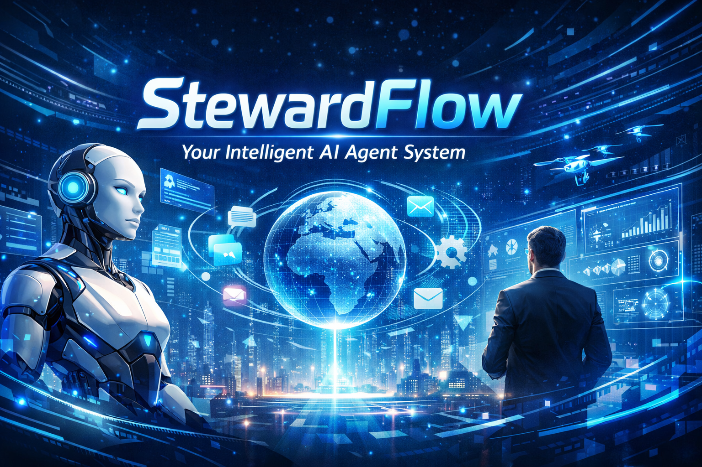

# StewardFlow: ReAct & HITL Agent



StewardFlow is a FastAPI-based ReAct + HITL (Human-in-the-Loop) agent system. It provides a visual front-end workspace, traceable execution logs, and extensible integrations for tools and MCP services. It is well-suited for quickly building intelligent assistants that are **controllable, traceable, and reproducible**.

## Demo

The LLM used in this case is deepseek-v3.2

> If you don't have a deepseek API key, you have two ways to experience the Agent project.
> 
> 1. Go to `https:www.modelscope.cn` to get a free API key, which supports 20 free model calls per day
> 2. Go to `https:bailian.console.aliyun.com` to apply for a free API Key, and new users can get a free trial credit of 1 million tokens for the deepseek-v3.2 model.


### 1. Open Xiaohongshu, search for the homepage of the Qianwen model, and summarize

**You can watch the 'public/demo1.mp4' video**

### 2. 查看当前目录有哪些文件？

**You can watch the 'public/demo2.mp4' video**

### 3. Use the `fs_list` semantic tool to inspect current workspace files

**You can watch the 'public/demo3.mp4' video**

## Key Features
- **ReAct + HITL orchestration**: supports steps that require user confirmation or additional input
- **Tool system**: built-in tools such as `fs_list`, `fs_glob`, `fs_read`, `fs_write`, `fs_stat`, `text_search`, `proc_run`, etc.
- **Unified tool result externalization**: every tool observation follows `kind=inline|ref`; large outputs are stored under `data/tool_results/`.
- **AgentRun browser sandbox**: create browser sandbox by template name, with VNC desktop sharing and browser automation tools
- **Web search & VNC browser view**: the UI can display real-time desktop sharing and retrieval results
- **Real-time WebSocket streaming**: shows execution logs such as Thought/Action/Observation/Final
- **Frontend-backend separation**: FastAPI backend + Vite/React frontend workspace

## Project Structure (Key Files)
- `main.py`: backend entry point
- `config.yaml.example`: backend configuration example
- `mcp_config.json.example`: MCP service configuration example
- `ui/`: frontend project (Vite + React)
- `public/banner.png`: banner image at the top of the README

## Quick Start

### 1. Configure the backend
```bash
cp config.yaml.example config.yaml
```

Edit config.yaml and fill in at least:
- llm.api_key
- llm.model
- llm.base_url

If you need MCP services (optional):
```
cp mcp_config.json.example mcp_config.json
```

### 2. Start the backend
```
python -m venv .venv
.\.venv\Scripts\activate
pip install -r requirements.txt
python main.py
```
Default port: `8000` (can be changed via `app.port` in `config.yaml`)

### 3. Start the frontend
```
cd ui
npm install
npm run dev
```
Default URL: http://localhost:5173

### 4. Open the UI and start using it
- The frontend communicates with the backend via `http://localhost:8000`
- WebSocket connects to `ws://localhost:8000/ws/{client_id}` to receive real-time events

## Configuration
### `config.yaml`
- `app.port`: backend listening port
- `log.level`: log level (e.g., info)
- `tool_result.root_dir`: storage root for externalized tool results (default: `data/tool_results`)
- `tool_result.inline_limit` / `tool_result.preview_limit`: inline/preview thresholds (in chars)
- `tool_result.always_externalize_tools`: tools that should always return `kind=ref`
- `agentrun.template_name`: template name used to create browser-sandbox
- `agentrun.account_id` / `agentrun.access_key_id` / `agentrun.access_key_secret` / `agentrun.region_id`: AgentRun auth/region settings (can be overridden by env vars)
- `agentrun.vnc_api_key`: upstream auth key for VNC proxy. When set, backend forwards both `X-API-Key` and `X-API-KEY` headers
- `llm.model` / `llm.api_key` / `llm.base_url`: LLM provider settings

## Ref Retrieval Workflow
- If an observation is `kind=ref`, only summary/preview and `ref.path` are in context.
- Recommended retrieval chain:
  1. Run `text_search(path=ref.path, query=..., max_matches=..., context_lines=...)` first
  2. Use `matches[0].line` as the line anchor
  3. Run `fs_read(path=ref.path, start_line=line-2, max_lines=40, max_bytes=...)` for bounded snippets
  4. Use `offset/length` only as an advanced fine-tuning fallback
- `snapshot_query` style per-tool query helpers are no longer used.

## API Endpoints
- `POST /agent/run`: start or continue a task
- `GET /agent/health`: agent subsystem health check
- `GET /health`: service health check
