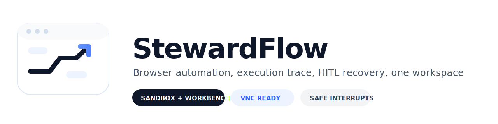
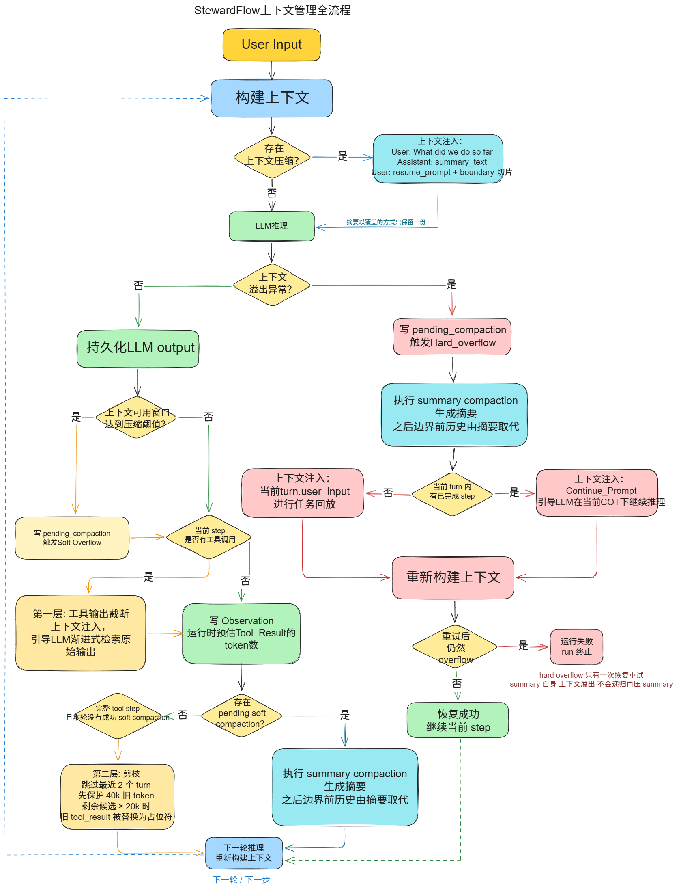

# StewardFlow: A Visual ReAct Agent for Browser and Tool Execution



[中文](README.md) | English

StewardFlow is an engineering-first agent workspace built with `FastAPI` and `React`. It combines `ReAct` reasoning,
tool execution, browser automation, `HITL` recovery, execution trace visualization, and a Docker sandbox runtime in a
single interface. The point is not to build an agent that only chats, but one that can act in a real environment and
still remain observable, interruptible, and recoverable.

## Demo Case

### Demo Video

https://www.douyin.com/video/7616035754812247339

### 1. Code Writing

```text
Help me build a personal blog website and open it in a browser.
```

### 2. Parallel Tool Calls

```text
Run a parallel inspection on the current workspace. The following tasks are independent, so use tools in parallel
where possible instead of handling them one by one:
1. Count all `.py` files and the total number of lines of code
2. Count all `.md` files and the total number of lines of code
3. Search for all `TODO` and `FIXME`
4. Find the 10 largest files by size
5. Check whether `README.md`, `requirements.txt`, and `package.json` exist
```

### 3. Browser Automation

```text
Open Xiaohongshu.
Summarize the 10 most-liked posts published in the last week that include the #AI topic.
For each of those posts, list the title, content, whether it is an image post or a video, and the attached topics.
```

## Why StewardFlow

Most agent demos stop at "the model can call tools." StewardFlow focuses on what happens after that: once an agent is
inside the execution environment, how do you keep it visible, interrupt it safely, and resume without corrupting future
context?

Core capabilities:

- live execution trace for `thought`, `action`, `observation`, `final`, and token usage
- browser execution panel through noVNC, with browser tools running inside the sandbox
- `HITL` recovery flow for confirmation prompts, login, captcha, OAuth authorization, and access denial
- stop and context-boundary controls so incomplete work does not leak into future LLM context
- a single-sandbox runtime that powers both `AgentWorkbench` and `SandboxConsole`

## Architecture Overview


Key modules:

- `main.py`: wires together `ToolRegistry`, `TaskService`, `SandboxManager`, `MCPClient`, `ConnectionManager`, and the
  FastAPI lifecycle
- `TaskService`: initializes traces, manages queueing and active tasks, serializes execution per trace, and handles
  resume flows
- `TaskExecutor`: advances the state machine and pushes `thought`, `action`, `observation`, `final`, and `end` events
  over WebSocket
- `SandboxToolRuntime`: forwards tool calls into the sandbox-internal HTTP API
- `SandboxManager`: creates, deletes, health-checks, and reads Docker sandbox logs
- `AgentWorkbench`: provides chat, execution traces, browser view, `HITL`, and stop interaction
- `SandboxConsole`: exposes sandbox health diagnostics and log output

## State Machine


## Context Management



## Quick Start in 5 Minutes

### Prerequisites

You will need:

- Docker Engine
- a Python virtual environment workflow
- Node.js and npm
- an OpenAI-compatible LLM API key

### 1. Build the sandbox image

```bash
cd sandbox
docker build -t gui-sandbox:dev -f Dockerfile .
```

### 2. Configure the backend

Copy the config file:

```bash
cp config.yaml.example config.yaml
# PowerShell
Copy-Item config.yaml.example config.yaml
```

At minimum, confirm these fields:

- `llm.api_key`
- `llm.model`
- `llm.base_url`
- `sandbox.image`
- `sandbox.public_host`
- `sandbox.healthcheck_host`
- `sandbox.docker_base_url`
- `sandbox.start_url`

Field notes:

- `sandbox.image`: the default sandbox image, usually `gui-sandbox:dev`
- `sandbox.public_host`: the host address used by the frontend to access noVNC and sandbox APIs
- `sandbox.healthcheck_host`: the address used by the backend to probe sandbox `/health`, usually the same as
  `public_host`
- `sandbox.docker_base_url`: the address used by the backend to access Docker Engine, for example
  `tcp://127.0.0.1:2375`
- `sandbox.start_url`: the default page opened when the browser starts, currently recommended as
  `chrome://new-tab-page/`

### 3. Start the backend

```bash
python -m venv .venv
# Windows PowerShell
.\.venv\Scripts\Activate.ps1
pip install -r requirements.txt
python main.py
```

The backend listens on port `8000` by default. On startup, it automatically creates one sandbox and binds the agent
tool runtime to it.

### 4. Start the frontend

```bash
cd ui
npm install
npm run dev
```

Default frontend URL: `http://localhost:5173`

### 5. Open the workspace

- by default, the frontend connects to the backend at `http://localhost:8000`
- WebSocket URL: `ws://localhost:8000/ws/{client_id}`
- the browser panel uses the sandbox noVNC endpoint
- inspect current sandbox port mappings with `GET /sandboxes?include_exited=false`

## Runtime Model

### ReAct Main Loop

The main execution flow in StewardFlow is:

`THINK -> DECIDE -> EXECUTE -> OBSERVE -> GUARD -> END`

Where:

- `THINK`: the LLM proposes the next step
- `DECIDE`: determines whether to answer directly, call a tool, or enter `HITL`
- `EXECUTE`: runs tools or browser actions
- `OBSERVE`: collects results and feeds them back into the loop
- `GUARD`: enforces blocking states, confirmations, interruptions, and context boundaries

### Stop / CANCELLED Semantics

- when the frontend is idle, the primary button shows `Send`
- after the first request is sent but before a `trace_id` is returned, the button shows loading
- while a run is active and a `trace_id` is available, the primary button switches to `Stop`
- once a trace enters `WAITING/HITL`, `Stop` is no longer shown

Backend behavior:

- `POST /agent/stop` locates the active task for the target `trace_id` and triggers cancellation
- the executor explicitly handles `asyncio.CancelledError` and marks the trace as `CANCELLED`
- an interrupted trace can later start a new turn on the same trace

### HITL and Context Boundaries

StewardFlow is intentionally strict about what is allowed to enter future context.

Rules:

- plain-text answers enter future messages only after the final answer is complete
- tool steps enter future messages only when a complete `assistant.tool_calls` block and all paired tool results are
  present
- `REQUEST_INPUT` continuations are injected only after the user actually completes them with `done`
- cancelled or unfinished steps are excluded from future LLM context

## Built-in Tools and Runtime

### File and Command Tools

- `bash`
- `glob`
- `read`
- `grep`
- `edit`
- `write`

### Browser Tools

- `browser_navigate_page`
- `browser_take_snapshot`
- `browser_click`
- `browser_fill`
- `browser_wait_for`
- `browser_take_screenshot`
- `browser_press_key`
- `browser_handle_dialog`
- `browser_hover`
- `browser_upload_file`
- `browser_select_page`

### Tool Contract

- all tools return `output` plus optional `metadata`
- oversized output uses `metadata.truncated=true` and `metadata.outputPath` to reference the full result
- browser tools attach the current tab summary
- when login, captcha, OAuth authorization, or access denial pages are detected, tools may attach
  `metadata.hitlBarrier`

### Sandbox Model

- the backend automatically creates 1 sandbox on startup
- the current agent runtime binds only to that startup sandbox by default
- `New Session` resets browser state but does not destroy the sandbox
- `SandboxConsole` uses `/sandboxes/health` and `/sandboxes/{sandbox_id}/logs` for diagnostics

## API Overview

### Agent API

- `POST /agent/run`: create a new trace, resume `WAITING/HITL`, or start a new turn on the same trace
- `POST /agent/stop`: stop the current active run
- `GET /agent/health`: check agent service health
- `GET /agent/registry-summary`: inspect the current tool registry summary

### Sandbox API

- `GET /sandboxes`: list sandboxes
- `POST /sandboxes`: create a sandbox
- `GET /sandboxes/{sandbox_id}`: inspect one sandbox
- `POST /sandboxes/{sandbox_id}/start`: start a sandbox
- `POST /sandboxes/{sandbox_id}/stop`: stop a sandbox
- `DELETE /sandboxes/{sandbox_id}`: delete a sandbox
- `GET /sandboxes/health?sandbox_id=<optional>`: check a specific sandbox or the current running sandbox
- `GET /sandboxes/{sandbox_id}/logs`: read sandbox logs
- `POST /sandboxes/browser/reset`: reset browser tab state in the current running sandbox

## Configuration Notes

### `config.yaml`

- `app.port`: backend listening port
- `log.level`: log level
- `llm.model` / `llm.api_key` / `llm.base_url`: OpenAI-compatible LLM configuration
- `sandbox.image`: default sandbox image
- `sandbox.public_host`: host address used by the frontend to access noVNC
- `sandbox.healthcheck_host`: address used by the backend to probe sandbox `/health`
- `sandbox.docker_base_url`: Docker Engine address
- `sandbox.start_url`: initial browser page
- `sandbox.display_width` / `sandbox.display_height`: virtual desktop resolution

### `mcp_config.json.example`

- the repository already includes MCP client and connector implementations
- both `stdio` and `http` MCP server integrations are supported

## Known Limitations

- checkpoints, message caches, and WebSocket connection state are currently stored only in process memory; restarting
  the service does not recover in-flight traces
- the LLM provider currently uses the async chat completion path; `stop` usually reaches a waiting LLM request faster,
  but actual cancellation latency still depends on the OpenAI SDK, the underlying HTTP connection, and upstream
  compatibility service behavior
- some tools may perform non-cancellable internal I/O; a trace can enter `CANCELLED` before the underlying await
  actually stops
- the current agent runtime binds only to the sandbox automatically created on startup; manually created sandboxes do
  not automatically become the active execution target
- `CheckpointStore` and `InMemoryCacheManager` are still memory-backed and do not persist to disk

## Special Thanks

- `docker-baseimage-gui` for the base image:
  https://github.com/jlesage/docker-baseimage-gui
- `opencode` for tool runtime and interaction design references:
  https://github.com/anomalyco/opencode
- `mcp-use` for MCP client design references:
  https://github.com/mcp-use/mcp-use
