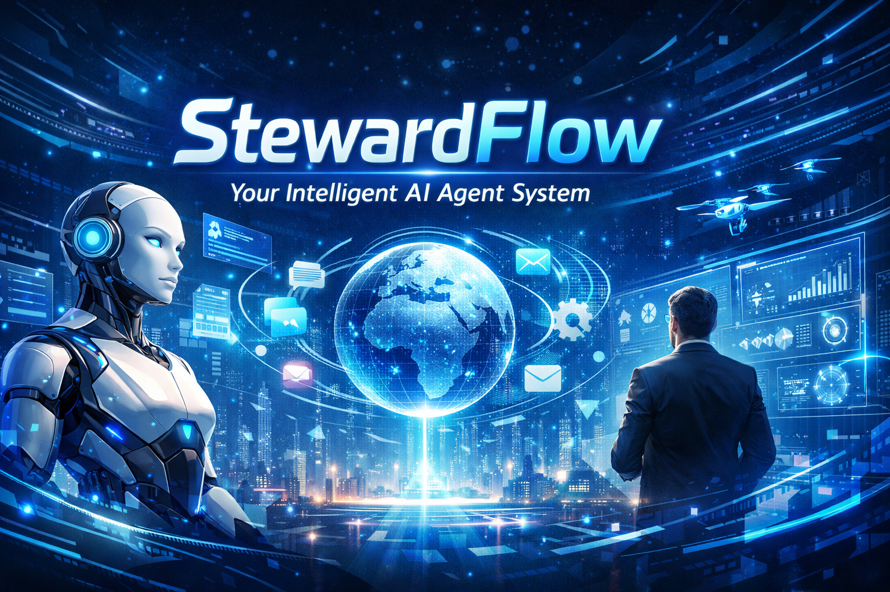
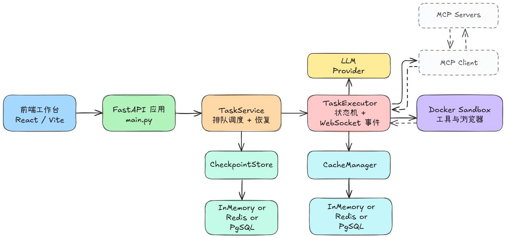
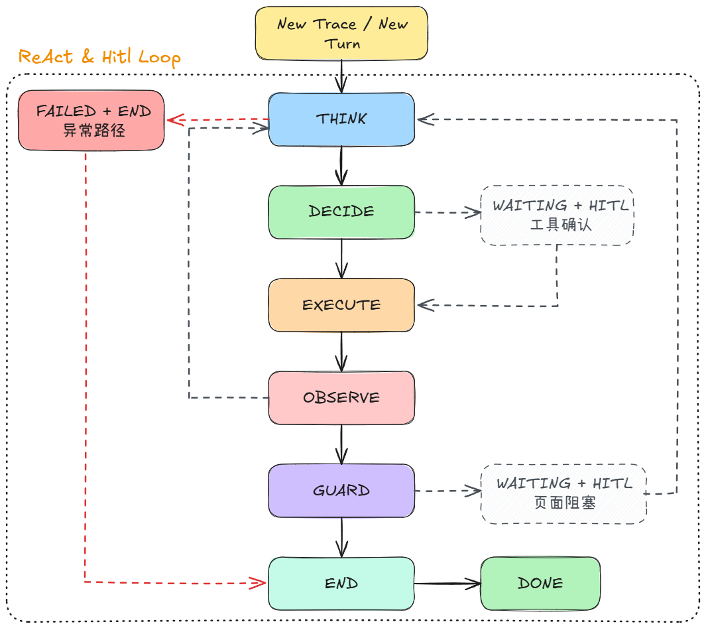

# StewardFlow: ReAct & HITL Agent



[中文](README.md) | English

StewardFlow is a visual `ReAct Agent` built with `FastAPI` + `React`. It supports `MCP Server` integration, ships with a built-in `Docker sandbox`, and provides traceable execution logs, a browser noVNC view, HITL recovery, and trace-oriented in-memory checkpoints plus context reconstruction.

## Latest Updates

- Added frontend stop control: the primary input button now shows loading while waiting for the first `trace_id`, then switches to `Stop` once the backend run can be targeted.
- Added `POST /agent/stop` so an in-flight trace can be interrupted without shutting down the backend service.
- Added `CANCELLED` as a terminal trace state; cancelled traces can later start a new turn on the same trace.
- Context reconstruction now serializes committed history only, so incomplete tool transcripts are not fed back into future LLM messages.
- HITL synthetic continuation is injected only after `REQUEST_INPUT` is actually completed with `done`.

## Demo

The LLM used in the demos is `qwen3.5-plus`.

> If you do not have a qwen API key, you can try one of the following:
>
> 1. Get a free API key from `https://www.modelscope.cn/` with 20 free calls per day
> 2. Apply for a free API key from `https://bailian.console.aliyun.com/`; new users receive free trial credits for `qwen3.5-plus`

### 1. Open Xiaohongshu, search for the Qwen homepage, and summarize it

Watch `public/demo1.mp4`

### 2. Check which files exist in the current directory

Watch `public/demo2.mp4`

### 3. Use the `bash` tool inside the Docker sandbox

Watch `public/demo3.mp4`

## Feature Overview

- ReAct execution loop: `THINK -> DECIDE -> EXECUTE -> OBSERVE -> GUARD -> END`
- Two classes of HITL wait points:
  - high-risk `bash` command confirmation
  - browser blocking signals such as login, verification code, OAuth consent, or access denial
- Real-time WebSocket events: `thought`, `action`, `observation`, `final`, `hitl_confirm`, `hitl_request`, `token_info`, `error`, `end`
- Dual frontend workspaces:
  - `AgentWorkbench` for chat, run state, execution trace, and browser view
  - `SandboxConsole` for sandbox health checks and logs
- Automatic sandbox lifecycle: one sandbox is created on backend startup and removed on shutdown
- Scheduling safeguards in `TaskService`: global concurrency limit `4`, queue cap `128`, queue timeout `15s`
- Interruption safeguards:
  - active runs are stopped by backend task cancellation
  - traces already in `WAITING/HITL` do not expose `Stop`
  - interrupted partial steps are excluded from future LLM context

## Code Architecture



### Architecture Notes

- `main.py` wires together `ToolRegistry`, `TaskService`, `SandboxManager`, `MCPClient`, `ConnectionManager`, and the FastAPI lifecycle.
- `TaskService` handles trace initialization, queue scheduling, active-task tracking, per-trace serialization, and resuming `WAITING/HITL` or new-turn flows.
- `TaskExecutor` advances the state machine, handles `CancelledError` explicitly, and emits `thought/action/observation/final/end` events over WebSocket.
- `CheckpointStore` and `InMemoryCacheManager` are still in-memory only.
- `CacheManager` rebuilds committed context only:
  - plain-text answer steps enter context only after completion
  - tool steps enter context only when `assistant.tool_calls` and every tool result are structurally complete
  - HITL synthetic continuation is injected only after `REQUEST_INPUT(done)`
- `SandboxToolRuntime` forwards tool calls to the sandbox-internal HTTP API; browser tools attach tab state in `metadata` and may attach `metadata.hitlBarrier`
- `SandboxManager` creates, deletes, health-checks, and reads logs from Docker containers; the current runtime still binds the agent to the auto-created sandbox from startup

## State Machine Flow



## Quick Start

### 1. Build the sandbox image

```bash
cd sandbox
docker build -t gui-sandbox:dev .
```

### 2. Configure the backend

Copy the config file:

```bash
cp config.yaml.example config.yaml
# PowerShell
Copy-Item config.yaml.example config.yaml
```

At minimum, confirm these fields:

- `llm.api_key`
- `llm.model`
- `llm.base_url`
- `sandbox.image`
- `sandbox.public_host`
- `sandbox.healthcheck_host`
- `sandbox.docker_base_url`
- `sandbox.start_url`

Notes:

- `sandbox.public_host`: node IP used by StewardFlow to reach the sandbox API and noVNC
- `sandbox.healthcheck_host`: address the backend uses for sandbox `/health`, usually the same as `public_host`
- `sandbox.docker_base_url`: Docker Engine reachable by the backend, for example `tcp://192.168.130.147:2375`

### 3. Start the backend

```bash
python -m venv .venv
# Windows PowerShell
.\.venv\Scripts\Activate.ps1
pip install -r requirements.txt
python main.py
```

The default port is `8000`. On startup, the backend automatically creates one sandbox and binds the agent runtime to it.

### 4. Start the frontend

```bash
cd ui
npm install
npm run dev
```

Default frontend URL: `http://localhost:5173`

### 5. Open the frontend

- The frontend calls the backend through `http://localhost:8000`
- WebSocket URL: `ws://localhost:8000/ws/{client_id}`
- The browser panel uses the sandbox noVNC URL; inspect the current mapped ports with `GET /sandboxes?include_exited=false`

## Run and Stop Semantics

### Primary button behavior

- idle: `Send`
- first run started but `trace_id` not returned yet: loading
- active run with `trace_id`: `Stop`
- `WAITING/HITL`: no `Stop`; existing HITL interaction takes over

### Backend stop behavior

- `POST /agent/stop` resolves the active worker task for a trace and cancels it
- the executor catches `asyncio.CancelledError` and records the trace as `CANCELLED`
- interrupted draft steps are not persisted as reusable context

### Context boundary rules

- plain-text answer step: only completed answers are serialized back into messages
- tool step: only complete `assistant.tool_calls` plus all matching tool results are serialized
- HITL continuation: injected only when `REQUEST_INPUT` has completed with `request_input == "done"`

## Built-in Tools

### File and command tools

- `bash`
- `glob`
- `read`
- `grep`
- `edit`
- `write`

### Browser tools

- `browser_navigate_page`
- `browser_take_snapshot`
- `browser_click`
- `browser_fill`
- `browser_wait_for`
- `browser_take_screenshot`
- `browser_press_key`
- `browser_handle_dialog`
- `browser_hover`
- `browser_upload_file`
- `browser_select_page`

### Current tool contract

- every tool returns `output` plus optional `metadata`
- oversized output is referenced through `metadata.truncated=true` and `metadata.outputPath`
- browser tools attach current tab summaries and may attach `metadata.hitlBarrier` when blocking pages are detected

## API Overview

### Agent API

- `POST /agent/run`
  - without `trace_id`: create a new trace and enqueue execution
  - with a `trace_id` in `WAITING + HITL`: resume the current turn with one HITL input
  - with a `trace_id` in `DONE` / `FAILED` / `CANCELLED` + `END`: start a new turn on the same trace
- `POST /agent/stop`
  - active task exists: returns accepted and cancels the run
  - trace already `WAITING/HITL` or already terminal: returns a no-op response
- `GET /agent/health`
- `GET /agent/registry-summary`

### Sandbox API

- `GET /sandboxes`
- `POST /sandboxes`
- `GET /sandboxes/{sandbox_id}`
- `POST /sandboxes/{sandbox_id}/start`
- `POST /sandboxes/{sandbox_id}/stop`
- `DELETE /sandboxes/{sandbox_id}`
- `GET /sandboxes/{sandbox_id}/health`
- `GET /sandboxes/{sandbox_id}/logs`

## Configuration Notes

### `config.yaml`

- `app.port`: backend listening port
- `log.level`: log level
- `llm.model` / `llm.api_key` / `llm.base_url`: OpenAI-compatible LLM settings
- `sandbox.image`: default sandbox image
- `sandbox.public_host`: host address used by the frontend for noVNC
- `sandbox.healthcheck_host`: address used by the backend for sandbox `/health`
- `sandbox.docker_base_url`: Docker Engine address
- `sandbox.start_url`: initial Chromium URL
- `sandbox.display_width` / `sandbox.display_height`: virtual desktop resolution

### `mcp_config.json.example`

- the repository includes MCP client and connector implementations
- supports both `stdio` and `http` MCP integration

## Known Limitations

- checkpoints, message caches, and WebSocket connection state are still process-memory only; running traces are not recoverable after service restart
- the LLM provider path now uses async chat completion, so stop can usually interrupt an in-flight LLM await more quickly; actual cancellation latency still depends on the OpenAI SDK, the underlying HTTP connection, and upstream compatibility behavior
- some tool awaits may not be truly cancellable; the trace can still move to `CANCELLED`, but the underlying I/O latency depends on the tool implementation
- the agent runtime still binds only to the sandbox auto-created on startup; manually created sandboxes do not automatically become the active execution target

## Special Thanks

- `docker-baseimage-gui` for the base image:
  https://github.com/jlesage/docker-baseimage-gui
- `opencode` for tool-runtime and interaction design references:
  https://github.com/anomalyco/opencode
